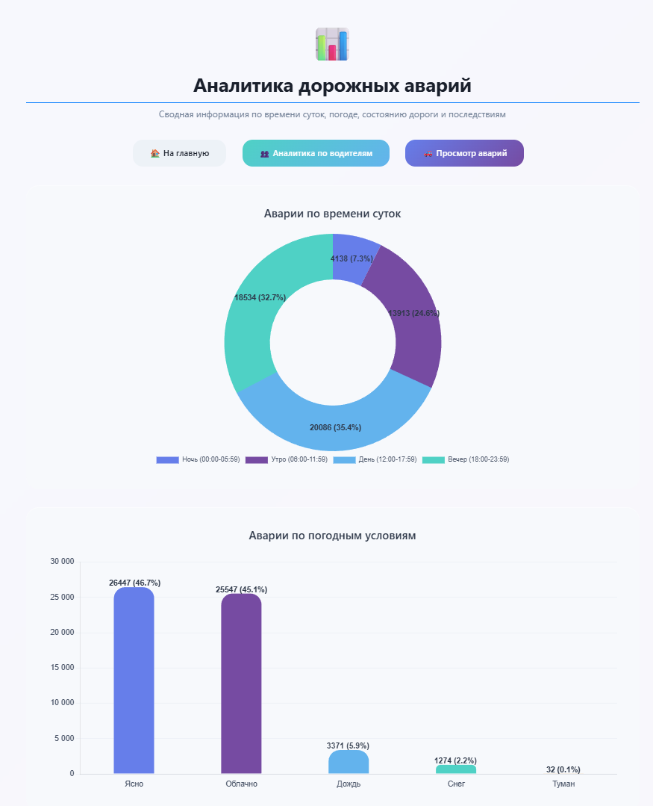
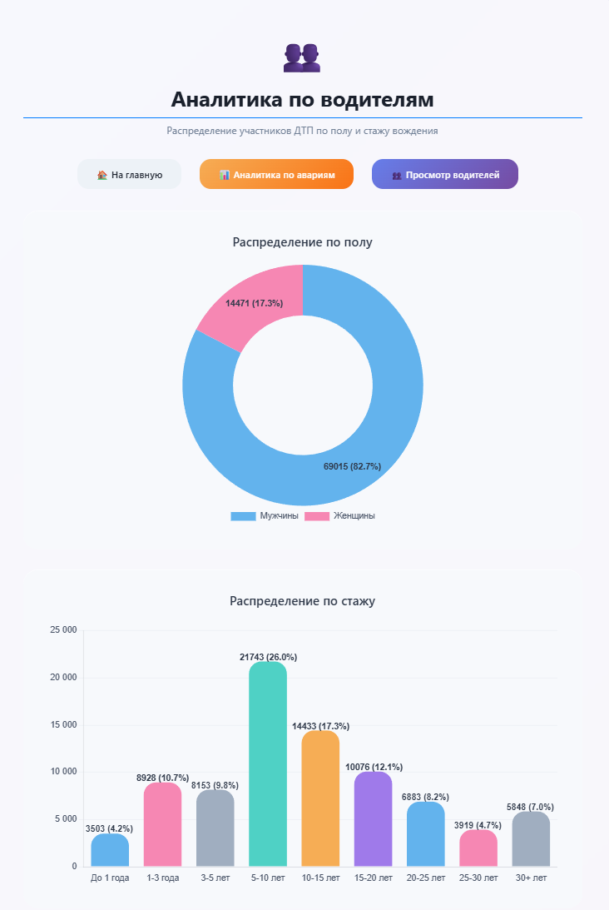

<div align="center">

# Time & Weather · SPB · ДТП

Интерактивная витрина данных ДТП Санкт‑Петербурга и других городов: импортируйте GeoJSON, исследуйте сводные таблицы и смотрите живую аналитику по времени суток, погоде, состоянию дороги и профилю водителей.


</div>

## ✨ Основные возможности

- **Импорт GeoJSON**: загрузка встроенного файла `sankt-peterburg.geojson` или пользовательского файла через удобный UI с валидацией.
- **Умный парсер**: преобразует GeoJSON в модели `Accident` и `Driver`, нормализует даты, погоду, состояние дороги и стаж.
- **Безопасный импорт**: повторная загрузка блокируется, если данные уже есть (во избежание дублей).
- **Стеклянный UI**: минималистичные страницы просмотра аварий и водителей с карточками статистики.
- **Аналитика**: диаграммы (Chart.js) по времени суток, погоде, смертельным исходам, состоянию дороги, полу, стажу (тонкие интервалы до 30+ лет).
- **Очистка БД**: одно нажатие — и база очищена, последовательности ID сбрасываются (`TRUNCATE … RESTART IDENTITY`).

## 🧱 Архитектура

```
src/main/java/ru/saltis/Time_Weather_SPB_DTP
├── controllers/        // MVC-контроллеры (домашняя, парсер, списки, аналитика)
├── services/
│   ├── GeoJsonParserService  // импорт и очистка
│   └── AnalyticsService      // агрегация статистик
├── repositories/
│   ├── AccidentRepository
│   └── DriverRepository
└── templates/         // Thymeleaf-шаблоны
    ├── geojson/       // загрузка и результат
    ├── accidents/     // список ДТП
    ├── drivers/       // список водителей
    └── analytics/     // диаграммы
```

## 🚀 Быстрый старт

### 1. Запуск инфраструктуры

```bash
docker-compose up -d
```

- Поднимет PostgreSQL (`localhost:5432`)
- Данные сохраняются в volume `postgres_data`

Остановка:

```bash
docker-compose down
```

### 2. Настройка приложения

Конфигурация по умолчанию в `src/main/resources/application.properties`:

### 3. Запуск Spring Boot

```bash
./mvnw spring-boot:run
# либо через IDE: TimeWeatherSpbDtpApplication
```

Приложение: <http://localhost:8080>

## 🧭 Пользовательские сценарии

1. **Домашняя страница** (`/`) — карточки навигации к спискам, парсеру и аналитике.
2. **Парсинг** (`/geojson`)  
   - загрузите файл или используйте встроенный;  
   - система блокирует импорт, если БД уже заполнена;  
   - предусмотрена кнопка очистки БД.
3. **Списки** (`/accidents`, `/drivers`)  
   - стеклянные таблицы с карточками `Всего`, `С погибшими`, `Средний стаж` и т.д.
4. **Аналитика** (`/analytics/accidents`, `/analytics/drivers`)  
   - диаграммы с подписями `значение (процент)`;  
   - интервалы стажа: `до 1`, `1-3`, …, `25-30`, `30+ лет`;  
   - отсутствующие/некорректные данные автоматически исключаются.

## 🧪 Тестовые данные

В проект включён примерный датасет: `src/main/resources/sankt-peterburg.geojson`.  
Импортируйте его через UI, чтобы сразу увидеть статистику и диаграммы.

## 📸 Галерея

<p align="center">
  
</p>
<p align="center">
  
</p>
<p align="center">
  
</p>

## 🧹 Обслуживание

- **Очистка БД**: кнопка «Очистить базу» в разделе GeoJSON вызывает `TRUNCATE` с `RESTART IDENTITY` для таблиц `accidents` и `drivers`.
- **Логи парсинга**: ошибки выводаятся в консоль сервиса (`GeoJsonParserService`), некорректные записи пропускаются, но импорт продолжается.

## 💡 Идеи для развития

- API для сторонних клиентов (REST/GraphQL)
- Role-based access control
- Геоспециализация: отображение точек на карте
- Расширение метрик (тип участника, транспорт, погодно-климатические слои)

---

✨ *Time & Weather · SPB · ДТП* — ваш старт для глубокого анализа дорожной обстановки в городе.
